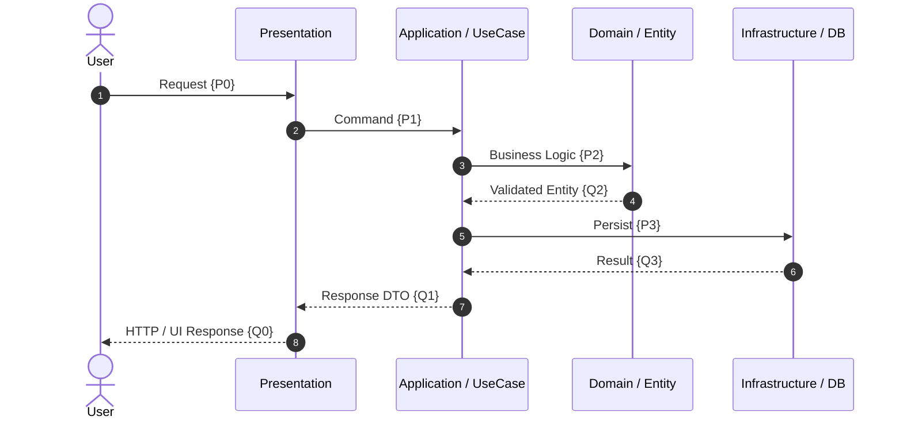

# Catlazy System Flow & State Trace

When invoked with `/catlazy11-flow`, discover, trace, and formally verify the end-to-end execution flow of the codebase across all architectural layers. The core objective is to prove that **logic does not stumble** — every step's Post-condition $\{Q_i\}$ satisfies the next step's Pre-condition $\{P_{i+1}\}$, and every vulnerability or logic gap is identified and reported.

---

### ⚙️ Core Workflow

Execute these phases in order. Never edit source files unless `fix-safe` mode is active and the user has approved the findings:

1. **Entrypoint Discovery:** Identify all system entry points. A valid entrypoint is any location where external input enters the system — HTTP routes, CLI commands, scheduled jobs, event listeners, WebSocket handlers, UI interaction handlers, or public SDK methods.

2. **Sequential Hoare Chain Tracing (DISMATH Ch. 08):** For each execution path, construct a chain of Hoare triples that spans every architectural layer:

   $$\{P_1\}\; S_1\; \{Q_1\} \;\;\land\;\; \{P_2\}\; S_2\; \{Q_2\} \;\;\land\;\; \dots \;\;\land\;\; \{P_n\}\; S_n\; \{Q_n\}$$

   where by the **Sequential Composition Rule** (Ch. 08):
   $$Q_i \implies P_{i+1} \quad \text{for all } i \in \{1, \dots, n-1\}$$

   Any step where $Q_i \not\implies P_{i+1}$ is a **logic stumble** — a `[flow-gap]` or `[flow-hoare-mismatch]` finding. Report it immediately.

3. **Branch Completeness Check (DISMATH Ch. 01–02):** For every branching point (conditional, switch, error boundary), build a partial truth table. A branch is complete if and only if all logical possibilities are handled:

   $$\text{Complete}(B) \iff \forall v \in \text{Inputs}(B),\; \exists h \in \text{Handlers}(B) : \text{Handles}(h, v)$$

   Minimum required branches for any I/O step: `[success]`, `[validation-error]`, `[auth-failure]`, `[not-found]`, `[server-error]`. Missing any case is `[flow-branch-incomplete]`.

4. **Security & Vulnerability Scan:** At every layer transition and external-input boundary, check for missing trust guards. Apply predicate logic (DISMATH Ch. 03–04):

   $$\forall r \in \text{Routes},\; \text{HasAuthGuard}(r) \land \text{HasInputValidation}(r) \land \text{HasTenantIsolation}(r)$$

   Violations produce tagged findings (`[flow-vuln-auth]`, `[flow-vuln-injection]`, `[flow-vuln-tx-leak]`).

5. **Loop & Recursion Termination Proof (DISMATH Ch. 07):** For any retry logic, polling, or recursive path, define and verify the Loop Variant:

   $$V(i) \in \mathbb{N},\quad V(0) > 0,\quad V(i+1) < V(i)$$

   By the Well-Ordering Property of $\mathbb{N}$, the loop terminates in finite steps. If no decrement guarantee exists, report `[flow-loop-unbounded]`.

6. **SAT Reachability (DISMATH Ch. 10):** Verify that every declared state or code path can be reached by some valid combination of inputs ($\exists \vec{x}: \text{Reach}(\text{State}, \vec{x}) \equiv \mathbf{T}$). If no valid input can reach a state, report `[flow-unreachable]`.

---

### 🏷️ Finding Tags

Ordered by severity (P1 → P3):

- **P1** `[flow-vuln-auth]`: Route, handler, or use-case is callable without authentication or authorization check. Input from an untrusted source can bypass access control.
- **P1** `[flow-vuln-injection]`: External input (query param, body, header, form field) reaches Domain logic, a SQL query, or command execution without passing a validation/sanitization layer.
- **P1** `[flow-vuln-tx-leak]`: A side-effect with financial or data-integrity impact (payment charge, balance deduction, DB multi-table write) occurs outside a transaction boundary or without an idempotency key guard.
- **P1** `[flow-gap]`: Logic stumbles — a function is called but has no implementation, a Promise is not awaited, a return value is silently discarded, or a handler is wired to a dead reference.
- **P2** `[flow-hoare-mismatch]`: The data contract (type, shape, required fields, null/undefined) emitted by one step does not satisfy the contract expected by the next step. The Hoare chain is broken: $Q_i \not\implies P_{i+1}$.
- **P2** `[flow-branch-incomplete]`: A conditional branch handles only the happy path. Negative cases (validation failure, empty result, permission denied, network timeout) are either missing or silently swallowed (`catch {}`, `err => null`).
- **P2** `[flow-loop-unbounded]`: A retry, polling, or recursive flow lacks a Well-Ordering Loop Variant. Risk of infinite loop or resource exhaustion under failure conditions.
- **P3** `[flow-unreachable]`: A declared branch, state, or code path can never be entered under any valid program input — dead code that inflates complexity without contributing behavior.

---

### 📐 Formal Basis (DISMATH Reasoning Foundation)

- **Ch. 08 (Hoare Logic — Sequential Composition):** The entire flow is a formal composition of Hoare triples. A valid flow requires $Q_i \implies P_{i+1}$ at every step boundary. Reference: [`docs/logics/dismath/08-program-correctness-and-hoare-logic.md`](../../docs/logics/dismath/08-program-correctness-and-hoare-logic.md).
- **Ch. 01–02 (Propositional Logic & Logical Equivalences — Branch Completeness):** Branch exhaustiveness is a truth-table property. Every branching predicate must yield a handler for every truth-value combination. Reference: [`docs/logics/dismath/01-propositional-logic.md`](../../docs/logics/dismath/01-propositional-logic.md).
- **Ch. 03–04 (Predicate Logic & Nested Quantifiers — Trust Guard Predicates):** Security invariants are universally quantified: $\forall r \in \text{Routes}, P(r)$ must hold. A counterexample $\exists r : \neg P(r)$ is a P1 vulnerability finding. Reference: [`docs/logics/dismath/03-predicate-logic-and-quantifiers.md`](../../docs/logics/dismath/03-predicate-logic-and-quantifiers.md).
- **Ch. 05 (Rules of Inference — Fallacy Guard):** Reasoning about flow must use valid inference (Modus Ponens, Modus Tollens). Never flag a finding by affirming the consequent or circular reasoning. Reference: [`docs/logics/dismath/05-rules-of-inference.md`](../../docs/logics/dismath/05-rules-of-inference.md).
- **Ch. 07 (Mathematical Induction & Well-Ordering — Loop Termination):** Loop termination is guaranteed iff a strictly decreasing Loop Variant $V(i) \in \mathbb{N}$ exists. Reference: [`docs/logics/dismath/07-mathematical-induction-and-recursion.md`](../../docs/logics/dismath/07-mathematical-induction-and-recursion.md).
- **Ch. 10 (SAT Reachability — Dead Path Detection):** A state is dead iff no satisfying input assignment reaches it: $\nexists \vec{x}: \text{Reach}(\text{State}, \vec{x}) \equiv \mathbf{T}$. Reference: [`docs/logics/dismath/10-puzzle-solving-and-sat-modeling.md`](../../docs/logics/dismath/10-puzzle-solving-and-sat-modeling.md).

---

### Standards Resolution

Before tracing, resolve architectural and design standards in this order:

1. Use the target repository's `docs/architecture/` and `docs/logics/dismath/` when they exist.
2. Otherwise, use the canonical directories in the installed Catlazy bundle.
3. State which standards source was used in the Inspection Summary.

---

### Task Context and Arguments

```text
catlazy11-flow [report|trace-deep|diagram-only|fix-safe]
               [--scope <feature-path-or-module>]
               [--entrypoint <route-or-function-name>]
               [--base <commit-or-ref>] [--files <path,...>]
               [--format normal|strict] [--language <code>]
```

- `report` (default): trace, analyze, and produce the full output report. Never edits source files.
- `trace-deep`: report mode that also recursively descends into all indirect call chains, utility functions, and shared modules.
- `diagram-only`: emit only the Mermaid Sequence Diagram and Hoare Table without the full checklist. Useful for documentation generation.
- `fix-safe`: after user approval of findings, apply only P1/P2 fixes that are local and low-risk (adding missing error branches, inserting validation guards). Never auto-fix auth logic, transactions, or migrations.

---

### 🚨 STRICT OUTPUT FORMAT (CRITICAL)

Do not output conversational text before the `### 🔎 Inspection Summary` heading. Respond in the user's language.

---

### 🔎 Inspection Summary

- **Target / Scope:** traced feature, entrypoint(s), architectural layers traversed, and resolved file list.
- **Standards Source:** state whether target repository (`docs/`) or bundled Catlazy standards were used.
- **Observation:** concise end-to-end flow description, total steps traced, and high-level vulnerability summary.

---

### 📋 Inspection Checklist

- `[PASS]` / `[FAIL]` / `[N/A]` `[flow-gap]` Logic continuity — every step connects to the next without stumbling
- `[PASS]` / `[FAIL]` / `[N/A]` `[flow-hoare-mismatch]` Hoare contract alignment — $Q_i \implies P_{i+1}$ at all layer boundaries
- `[PASS]` / `[FAIL]` / `[N/A]` `[flow-branch-incomplete]` Branch completeness — all negative paths handled
- `[PASS]` / `[FAIL]` / `[N/A]` `[flow-vuln-auth]` Authentication / Authorization guard at every entry point
- `[PASS]` / `[FAIL]` / `[N/A]` `[flow-vuln-injection]` Input validation before Domain / DB boundary
- `[PASS]` / `[FAIL]` / `[N/A]` `[flow-vuln-tx-leak]` Transaction boundary and idempotency guard on side-effects
- `[PASS]` / `[FAIL]` / `[N/A]` `[flow-loop-unbounded]` Loop / retry termination via Well-Ordering Variant
- `[PASS]` / `[FAIL]` / `[N/A]` `[flow-unreachable]` SAT reachability — no dead states or dead branches

#### 🗺️ End-to-End Flow Diagram

Render a Mermaid `sequenceDiagram` with `autonumber` covering every traced step. Use `alt`/`else` blocks to show all major branches (happy path and failure paths). Mark any `[FAIL]` step with an inline `Note` annotation.



#### 📐 Formal Hoare Step Chain Table

| Step ($i$) | Layer & Component | Pre-condition $\{P_i\}$ | Statement $S_i$ | Post-condition $\{Q_i\}$ | Invariant $\{I\}$ | Status |
|---|---|---|---|---|---|---|
| **1** | `Pres: Router` | `ValidRequest(req)` | Parse & Auth check | `AuthorizedCmd(cmd)` | Auth token valid | `[PASS/FAIL]` |
| **...** | `...` | `...` | `...` | `...` | `...` | `...` |

#### Detailed Findings (for every `[FAIL]`)

- **Target:** `[file:line]` or `[layer/component]`
- **Tag & Severity:** `[flow-*]` (P1/P2/P3) — citing DISMATH chapter and Catlazy rule
- **Evidence:** exact observed code, missing handler, or broken contract
- **Smallest Fix:** minimal non-overengineered remediation — one addition, one guard, one return type change

---

### 🐈 Catlazy Finish Check

- **Scope & Safety:** `[PASS]` / `[FAIL]` / `[N/A]`
- **Validation & Freshness:** `[PASS]` / `[FAIL]` / `[N/A]`
- **Diff & Side-effects:** `[PASS]` / `[FAIL]` / `[N/A]`
- **Verdict:** If no P1/P2 findings: **"Flow is continuous. Logic does not stumble. No vulnerabilities found."** Otherwise state the highest-severity open finding.
- **Status:** Conclude with exactly one status: `CATLAZY_DONE`, `CATLAZY_BLOCKED: <reason>`, or `CATLAZY_UNVERIFIED: <missing check>`.
